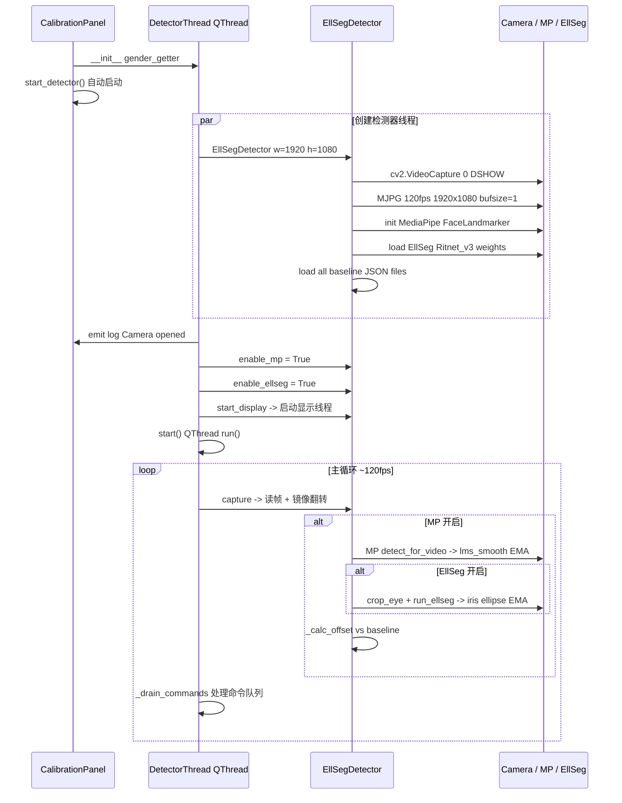
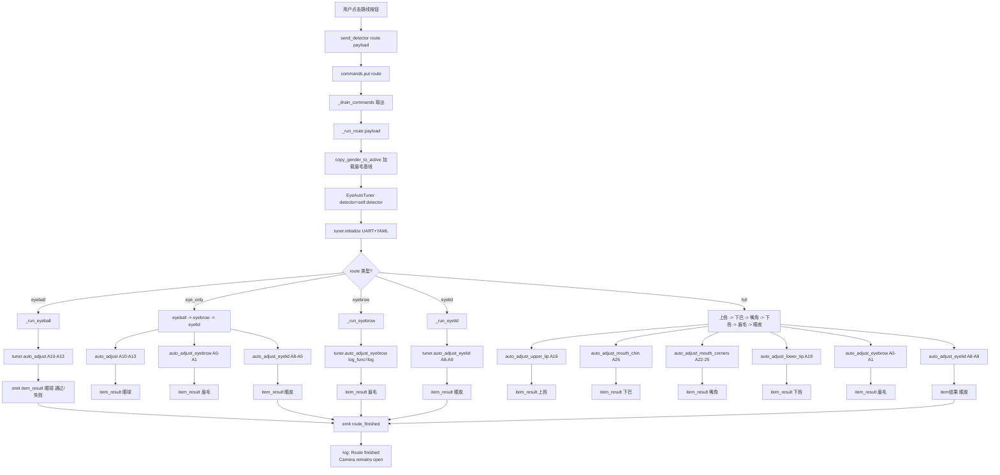

# FaceMark 工作流程图

## 三核心文件架构总览

```
┌─────────────────────────────────────────────────────────────────────┐
│                        qt_calibration_panel.py                       │
│                     (Qt UI + 线程编排 / 入口)                         │
│                                                                      │
│  CalibrationPanel (QMainWindow)                                      │
│  ┌──────────┐ ┌──────────┐ ┌──────────┐ ┌──────────┐               │
│  │ 基线录制  │ │ 手动控制  │ │ 自动路线  │ │ 通过状态  │               │
│  │ Group    │ │ Group    │ │ Group    │ │ Group    │               │
│  └────┬─────┘ └────┬─────┘ └────┬─────┘ └────┬─────┘               │
│       │            │           │           │                         │
│       ▼            ▼           ▼           ▼                         │
│  DetectorThread (QThread) ← 命令队列 Queue                          │
│       │                                                                │
│       ├──► _run_route(payload) ──► EyeAutoTuner                      │
│       │       │                                                      │
│       │       ├── eyeball     → auto_adjust()          A10-A13        │
│       │       ├── eye_only    → eyeball+eyebrow+eyelid               │
│       │       ├── full        → 上唇→下巴→嘴角→下唇→眉毛→眼皮        │
│       │       ├── eyebrow     → auto_adjust_eyebrow()   A0-A1         │
│       │       └── eyelid      → auto_adjust_eyelid()    A8-A9         │
│       │                                                                │
│       ├──► _handle_command()                                          │
│       │     ├── gender/toggle_mp/toggle_ellseg/...                    │
│       │     ├── save_* (基线录制)                                     │
│       │     └── eyelid_open/close (手动控制: ±1°)                    │
│       │                                                               │
│       └──► run() 主循环: capture → detect → drain_commands            │
│                  │                                                    │
│                  ▼                                                    │
│         ┌──────────────────┐                                           │
│         │  EllSegDetector   │  (共享实例, 由 detector 引用)             │
│         │  ellseg_scorer.py │                                           │
│         └────────┬─────────┘                                           │
└──────────────────┼─────────────────────────────────────────────────────┘
                   │ 共享 detector 实例
                   ▼
┌──────────────────────────────────────────────────────────────────────┐
│                          eye_auto_tuner.py                            │
│                    (舵机控制 + 自动调整算法)                            │
│                                                                        │
│  EyeAutoTuner                                                         │
│  ├── controller: FaceController (UART 舵机硬件, COM5 115200)         │
│  ├── scorer: EllSegDetector (外部传入共享 / 自建)                     │
│  │                                                                    │
│  ├── auto_adjust()              → A10-A13 眼球                        │
│  ├── auto_adjust_eyebrow()       → A0-A1  眉毛 (两阶段策略)           │
│  ├── auto_adjust_eyelid()        → A8-A9  眼皮                        │
│  ├── auto_adjust_upper_lip()     → A16    上唇                        │
│  ├── auto_adjust_mouth_chin()    → A26    下巴                        │
│  ├── auto_adjust_lower_lip()     → A19    下唇                        │
│  └── auto_adjust_mouth_corners() → A22-A25 嘴角(两阶段:竖→横)        │
│                                                                        │
│  每个调整函数通用迭代模式:                                                │
│  ┌──────────────────────────────────────────────────────────┐         │
│  │  collect_*_samples(n=60,trim=10) → 排序修剪 → 平均信号   │         │
│  │                              ↓                             │         │
│  │                   判断合格? (≤ 容差?)                      │         │
│  │                    ↓是          ↓否                       │         │
│  │              return PASS    send_servo() → wait → 下一轮   │         │
│  └──────────────────────────────────────────────────────────┘         │
└──────────────────────────────┬───────────────────────────────────────┘
                               │ 调用 scorer 的 get_*_signal()
                               ▼
┌──────────────────────────────────────────────────────────────────────┐
│                          ellseg_scorer.py                             │
│                 (摄像头 + MediaPipe + EllSeg 检测引擎)                │
│                                                                        │
│  EllSegDetector                                                       │
│  ├── cap: cv2.VideoCapture 1920x1080 MJPG 120fps buffersize=1        │
│  ├── landmarker: MediaPipe FaceLandmarker (VIDEO mode)               │
│  ├── ellseg_model: RitNet_V3 (GPU/CPU EllSeg 虹膜分割)              │
│  │                                                                    │
│  ├── capture()      → cv2.read + flip_horizontal                     │
│  ├── detect(frame)  → MP关键点(EMA平滑) + EllSeg椭圆(EMA平滑) + 偏移 │
│  │                                                                    │
│  ├── get_guide_signal()      → {L/R_dX,dY,dist,adj_X,adj_Y}        │
│  ├── get_eyebrow_signal()    → {BIG L/R,slope,symmetry,qualified}   │
│  ├── get_eyelid_signal()     → {EAR L/R,delta,qualified}            │
│  ├── get_mouth_signal()      → {MAR,delta,qualified}                 │
│  ├── get_upper_lip_signal()  → {ULR,delta,qualified}                 │
│  ├── get_lower_lip_signal()  → {LLR,delta,qualified}                 │
│  ├── get_mouth_corner_signal()→ {L/R dx,dy,dist,qualified}          │
│  ├── get_head_signal()       → {nose_dx/dy,tilt,symmetry,ok}       │
│  │                                                                    │
│  ├── save_current_*_baseline() → JSON 文件持久化                      │
│  └── _display_loop(): 独立线程 HUD渲染 + cv2.imshow + 键盘响应       │
│                                                                        │
│  EMA 平滑: LMASmoother(alpha=0.35) + EllipseSmoother(alpha=0.3)     │
└──────────────────────────────────────────────────────────────────────┘
```

---

## 流程一：系统启动



---

## 流程二：自动调整路线调度



---

## 流程三：眼球自动调整 A10-A13

```mermaid
flowchart TD
    BEGIN[auto_adjust 开始] --> CHECK_BL{baseline 存在?}
    CHECK_BL -->|否| RET_FAIL[return False 0 {}]
    CHECK_BL -->|是| DISP[start_display]

    DISP --> READ[读取 A10-A13 当前角度 list_temp_deg]
    READ --> LOOP{iteration < max_iter?}

    LOOP -->|否| TIMEOUT[return False iter {}]
    LOOP -->|是| STOP{user_pressed_stop?}
    STOP -->|是| BREAK[break return]
    STOP -->|否| HUD[update_hud Iter N/M]

    HUD --> COLLECT[collect_guide_samples n=60 trim=10]
    COLLECT --> OPEN_MP[enable_mp=True enable_ellseg=True]

    OPEN_MP --> SAMPLE_LOOP[采集60帧有效引导信号]
    SAMPLE_LOOP --> GOT{get_guide_signal None?}
    GOT -->|是 无脸| NO_FACE{连续无脸 >10?}
    NO_FACE -->|是| RETURN_NONE[return None]
    NO_FACE -->|否| SAMPLE_LOOP
    GOT -->|有数据| APPEND[(total_dist, offsets) 加入 samples]
    APPEND --> SAMPLE_LOOP

    RETURN_NONE --> WAIT_B[等待 wait_seconds]
    WAIT_B --> LOOP

    samples_ok[收集满60帧] --> CLOSE_MP[enable_mp=False enable_ellseg=False]
    CLOSE_MP --> SORT[按 total_dist 升序排序]
    SORT --> TRIM[去掉首尾各10帧]
    TRIM --> AVG[中间40帧求平均偏移]

    AVG --> QUALIFY{L_dist <= 2px AND R_dist <= 2px?}
    QUALIFY -->|是 PASS[PASSED!<br/>save_result best_eye_config.json<br/>export_angle_config servo_yaml<br/>return True iter {}]
    QUALIFY -->|否 CALC_DIR[计算舵机移动方向]

    CALC_DIR --> ADJ_MAP[adj_map 映射:
    - A10(L上下): dY<0 减角度
    - A11(R上下): dY<0 加角度 物理反向
    - A12(L内外): dX<0 减角度
    - A13(R内外): dX<0 加角度 物理反向]

    ADJ_MAP --> MOVE[遍历 A10-A13 发送角度 clamp范围]
    MOVE --> WAIT_C[分片等待 wait_seconds 每0.1s检查stop]
    WAIT_C --> LOOP
```

---

## 流程四：眉毛自动调整 A0-A1 (两阶段策略)

```mermaid
flowchart TD
    BEGIN[auto_adjust_eyebrow 开始] --> CHECK_BL{eyebrow baseline 完整?}
    CHECK_BL -->|否| RET_FAIL[return False 0 {}]
    CHECK_BL -->|是| DISP[start_display]
    DISP --> READ[读取 A0/A1 当前角度]
    READ --> SET_SIGN[a0_sign / a1_sign 方向系数]
    SET_SIGN --> INIT_P[phase=1 iteration=0]

    INIT_P --> LOOP{iteration < max_iter?}
    LOOP -->|否| TIMEOUT[return False iter {}]
    LOOP -->|是| STOP{user_pressed_stop?}
    STOP -->|是| BREAK
    STOP -->|否| COLL[collect_eyebrow_samples n=60 trim=10]

    COLL --> ALL_OK{L/R BIG in range<br/>AND symmetry OK<br/>AND slope OK?}
    ALL_OK -->|是| FULL_PASS[Phase N 全部达标 PASSED<br/>save + export<br/>return True]
    ALL_OK -->|否| PHASE_CHECK{当前 phase?}

    PHASE_CHECK ==>|Phase 1| P1_SYM{big_symmetry <= 容差?}
    P1_SYM -->|是| SWITCH_P2[phase=2<br/>log: Phase1结束 对称完成<br/>log: Phase2开始 同步升降<br/>continue 下一轮]
    P1_SYM -->|否| P1_PICK[选偏差大的一侧<br/>abs(L_dev) >= abs(R_dev)?]

    P1_PICK -->|左侧偏差大| P1_MOVE_L[调 A0 往对称中点方向<br/>delta = a0_sign * direction * step]
    P1_PICK -->|右侧偏差大| P1_MOVE_R[调 A1 往对称中点方向<br/>delta = -a1_sign * direction * step<br/>注: A1物理反向]

    P1_MOVE_L --> WAIT1[wait → loop]
    P1_MOVE_R --> WAIT1

    PHASE_CHECK ==>|Phase 2| P2_AVG{abs(avg_delta) <= BIG容差?}
    P2_AVG -->|是| BEST_FIT[Phase2 平均BIG达标 → PASSED<br/>忽略 slope/sym 问题<br/>log: Phase2结束<br/>return True]
    P2_AVG -->|否| P2_DIR{avg_delta 正负?}

    P2_DIR -->|偏高| DIR_DOWN[direction = -1 两边同时降]
    P2_DIR -->|偏低| DIR_UP[direction = +1 两边同时抬]
    P2_DIR -->|0| NO_MOVE[无需移动]

    DIR_UP --> P2_SYNC[A0 += a0_sign * dir * step<br/>A1 += -a1_sign * dir * step<br/>注: A1符号翻转]
    DIR_DOWN --> P2_SYNC
    P2_SYNC --> WAIT2[wait → loop]
    NO_MOVE --> WAIT2
    SWITCH_P2 --> LOOP
    BEST_FIT --> END
    FULL_PASS --> END
```

---

## 流程五：眼皮自动调整 A8-A9

```mermaid
flowchart TD
    BEGIN[auto_adjust_eyelid 开始] --> CHECK{eyelid_baseline 存在?}
    CHECK -->|否| FAIL[return False 0 {}]
    CHECK -->|是| DISP[start_display]
    DISP --> READ[读取 A8 A9 当前角度]
    READ --> LOOP{iteration < max_iter?}

    LOOP -->|否| TIMEOUT[return False iter {}]
    LOOP -->|是| STOP{stop?}
    STOP -->|是| BREAK
    STOP -->|否| COLL[collect_eyelid_samples n=60 trim=10<br/>MP ON / EllSeg OFF]

    COLL --> ENOUGH{samples >= 21?}
    ENOUGH -->|否| WAIT_N[wait → continue]
    ENOUGH -->|是| AVG[修剪排序取平均 EAR L/R delta L/R]

    AVG --> QUALIFY{|L_delta|<=tol AND |R_delta|<=tol?}
    QUALIFY -->|是| PASS[PASSED!<br/>save + export<br/>return True]
    QUALIFY -->|否| PICK[选偏差大的那只眼<br/>优先调 |delta| 大的]

    PICK --> CALC[delta_sign = sign * (-1 if d>tol else 1)<br/>new_angle += delta_sign * ear_step]
    CALC --> SEND[send_servo clamp到范围]
    SEND --> WAIT[wait → loop]
```

---

## 流程六：手动眼皮控制 (UI按钮)

```mermaid
flowchart LR
    BTN_OPEN[点击 眼皮开 按钮] --> CMD[send eyelid_open]
    BTN_CLOSE[点击 眼皮合 按钮] --> CMD2[send eyelid_close]

    CMD --> ENSURE[_ensure_tuner 延迟初始化]
    CMD2 --> ENSURE

    ENSURE --> READ_YAML[从 YAML 读取 A8/A9 范围:<br/>list_start_deg / list_end_deg]
    READ_YAML --> READ_CUR[读取当前角度<br/>tuner._temp_deg 或 YAML默认中值]

    READ_CUR --> OPEN_CALC[A8=max lo a8-1<br/>A9=min hi a9+1]
    READ_CUR --> CLOSE_CALC[A8=min hi a8+1<br/>A9=max lo a9-1]

    OPEN_CALC --> SEND[send_servo ch angle]
    CLOSE_CALC --> SEND

    SEND --> SYNC[手动同步 ctrl.list_temp_deg[ch]=angle]
    SYNC --> LOG[emit log 眼皮开/合: A8=x A9=y]
```

---

## 流程七：EllSegDetector detect() 内部管线

```mermaid
flowchart TD
    FRAME[input frame BGR] --> TIME[timestamp += 33ms]
    TIME --> MP_OFF{enable_mp?}
    MP_OFF -->|否| RESET[reset EMA smoothers<br/>return make_result MP off]
    MP_OFF -->|是| RGB[cvtColor BGR->RGB]
    RGB --> MP_IMG[mp.Image SRGB data=rgb]
    MP_IMG --> MP_DETECT[landmarker.detect_for_video]
    MP_DETECT --> NO_FACE{face_landmarks 空?}
    NO_FACE -->|是| RESET2[reset EMA → return No face]
    NO_FACE -->|有脸| LMS[提取 478 点像素坐标 lms_px]
    LMS --> EMA[LMASmoother.update alpha=0.35]
    EMA --> OUT[创建 result dict]
    OUT --> NOSE[out nose = lms[1]]

    NOSE --> ELL_ON{enable_ellseg?}
    ELL_ON -->|否| SKIP_ELL[跳过 EllSeg]
    ELL_ON -->|是| FOR_EYES[for left/right eye:]

    FOR_EYES --> CROP[crop_eye 裁剪眼部区域]
    CROP --> GRAY[cvtColor gray]
    GRAY --> ELLSEG[run_ellseg -> ritnet_v3 GPU推理]
    ELLSEG --> IRIS{iris 椭圆存在?}
    IRIS -->|否| ELL_RESET[reset EllipseSmoother]
    IRIS -->|是| ELL_EMA[EllipseSmoother.update alpha=0.3]
    ELL_EMA --> MAP_IRIS[映射回原图坐标 out left/right_iris]

    SKIP_ELL --> OFFSET[_calc_offset vs baseline]
    MAP_IRIS --> OFFSET

    OFFSET --> QUAL{_is_qualified L/R dist <= TOLERANCE 2px?}
    QUALIFY --> RESULT[out qualified = bool<br/>out offset = dict<br/>out timing = tuple<br/>out._last_lms_smooth = lms]
    RESULT --> STORE[self.last_result = out]
```

---

## 数据流向总结

```
用户操作 (Qt UI)
    │
    ▼
命令队列 (queue.Queue)
    │
    ▼
DetectorThread.run() 主循环
    │
    ├─► 正常模式: capture → detect → 显示HUD → drain_commands
    │
    └─► Route模式: _route_running=True
            │
            ▼
        EyeAutoTuner (共享 detector)
            │
            ├─► collect_samples() 循环
            │       │
            │       ├─► scorer.enable_mp = True
            │       ├─► scorer.capture() × N帧
            │       ├─► scorer.detect(frame) × N帧
            │       ├─► scorer.get_*_signal() × N帧
            │       ├─► scorer.enable_mp = False
            │       └─► 修剪排序 → 平均
            │
            ├─► 判断合格?
            │       │
            │       ├─► 是 → PASSED → 保存结果
            │       └─► 否 → send_servo() → wait → 下一轮
            │
            └─► 返回 (passed, iterations, final_data)
                    │
                    ▼
                Qt log panel 更新通过/失败状态
```

## 关键设计决策

| 决策 | 原因 |
|------|------|
| **共享 detector 实例** | 避免两个进程抢摄像头 (RuntimeError) |
| **Queue 命令队列** | Qt主线程安全地向 DetectorThread 发指令 |
| **Route运行时暂停capture** | `_route_running=True` 时只 drain 不采集，让 tuner 自己控制采集节奏 |
| **EMA 平滑 alpha=0.35/0.3** | 过滤 MP/EllSeg 抖动，保留实时性 |
| **60帧采集 + 修剪10帧** | 抗异常值，40帧平均提高稳定性 |
| **眉毛两阶段策略** | 解决物理耦合问题：P1先对称，P2再同步升降 |
| **A1 符号翻转 (-a1_sign)** | 机械结构相反：A0增大=上，A1增大=下 |
| **YAML读取范围** | 不硬编码 min/max，适配不同舵机配置文件 |
| **显示独立线程** | _display_loop daemon thread，不阻塞主检测循环 |
